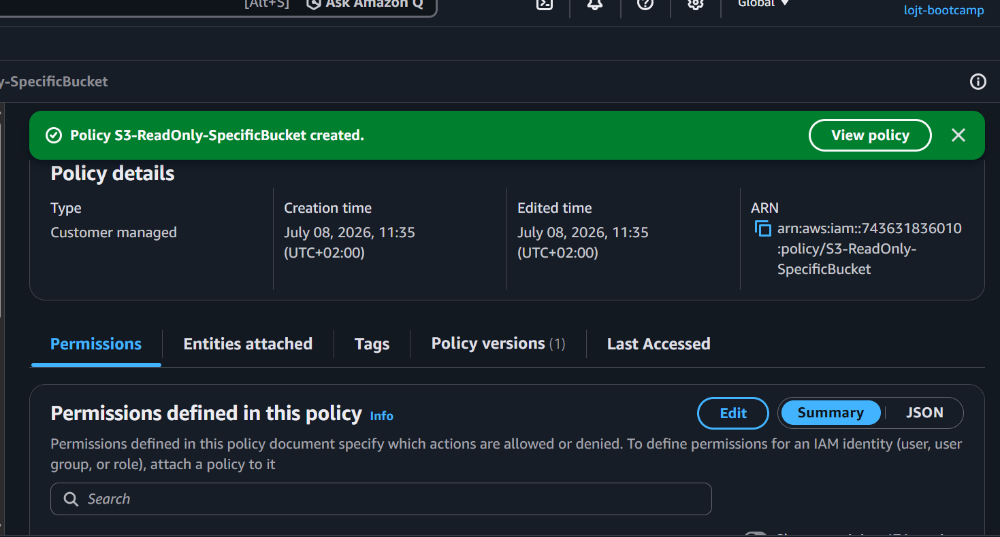
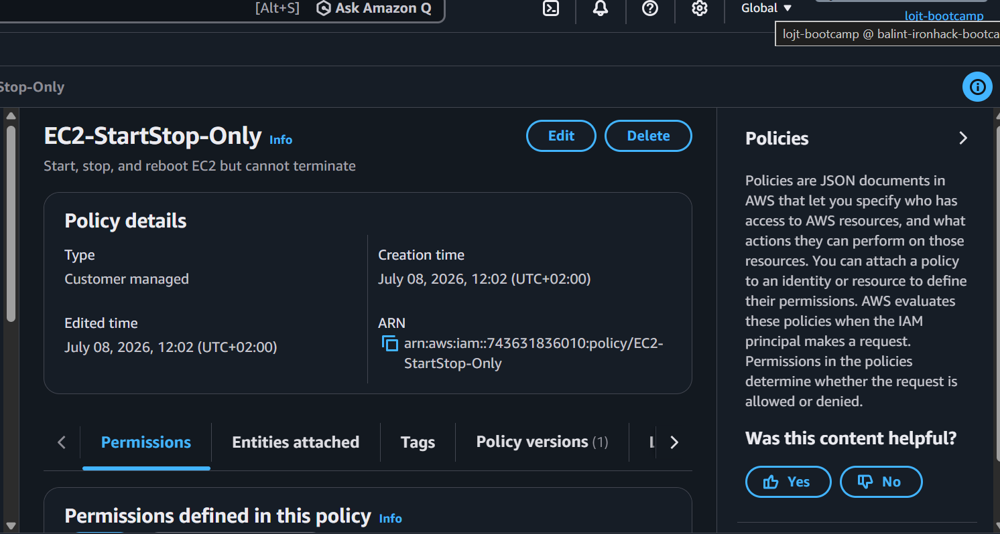
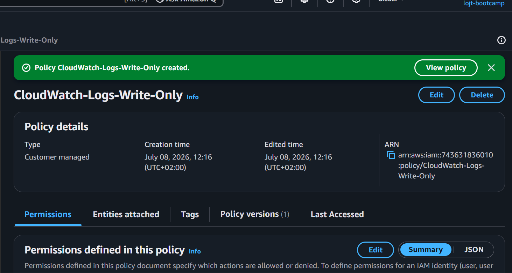
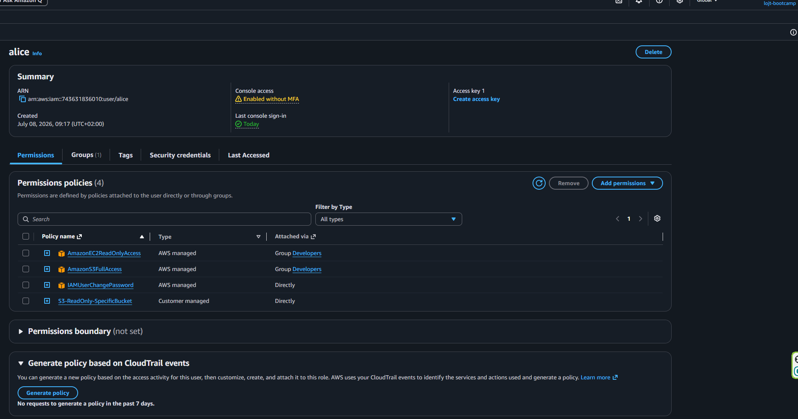
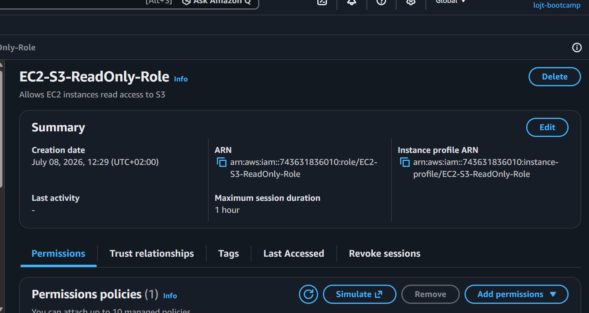
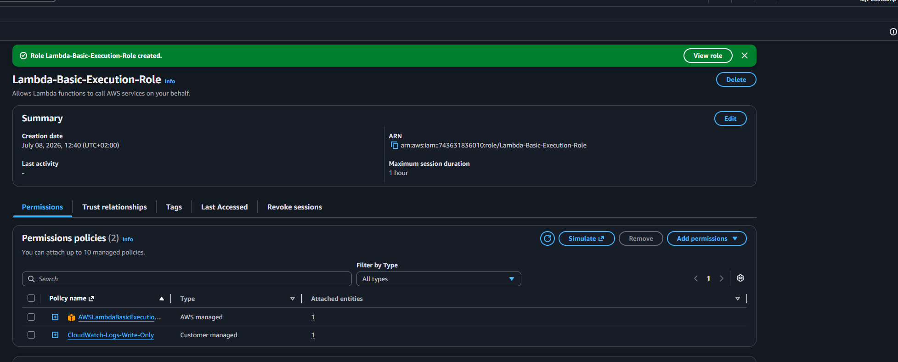
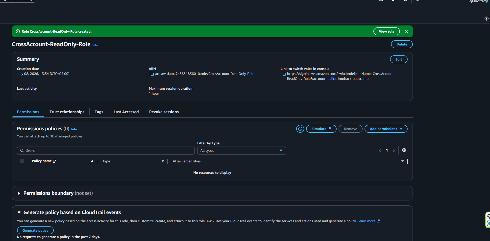
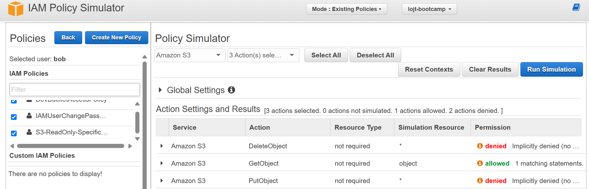

# Lab Solution: IAM Policies and Roles

**Student Name:** Balint Lojt__________________  
**Date:** 08/07/2026_________________  
**Lab Completion Time:** ___________ minutes

---

## Part 1: Understanding IAM Policy Structure

### Task 1: Policy Components Explanation

**Explain each component in your own words:**

**Version:**
It is the language edition that I'm writing in. I can specify here which rules and features I want to use when reading the document. For AWS, it usually is "2012-10-17"


**Statement:**
This is the main body of the policy, acting as the container for all your rules. It’s basically a big list where I write down all the individual permission blocks I want to enforce in the policy.


**Sid:**
optional but useful, this works as a nickname giving option. Makes it easier to remember what the given policy is about without digging deep inside the file itself. 

**Effect:**
It states whether the person can do a certain action or not. The only 2 options here are "Allow" or "Deny". It is straightforward that "Allow" would give permit to do the action, and "Deny" would not. 


**Action:**
It specifies what actions can be done (edit drafts, delete users, view invoices), and only the specified tasks here can be executed; anything that is not described here, the person has no permission.


**Resource:**
This draws the boundary line for the user. Specifies where exactly they can perform their actions. Which folder, which server, etc. 


## Part 2: Custom IAM Policies Created

### S3 Read-Only Policy

**Policy Name:** ___________________________

**Bucket Name Used:** ___________________________

**Policy JSON:**
```json
{
  "Version": "2012-10-17",
  "Statement": [
    
    
    
  ]
}
```

**Screenshot 1: S3 Custom Policy**


---

### EC2 Start/Stop Policy

**Policy Name:** ___________________________

**Policy ARN:** ___________________________

**Screenshot 2: EC2 Custom Policy**


---

### CloudWatch Logs Write Policy

**Policy Name:** ___________________________

**Policy ARN:** ___________________________

**Screenshot 3: CloudWatch Logs Policy**


---

## Part 3: Policy Attachments

### Policy Attached to User

**User Name:** ___________________________

**Policy Attached:** ___________________________

**Attachment Method:** ☐ Console ☐ CLI

**CLI Command (if used):**
```bash
_____________________________________________________________
_____________________________________________________________
```

**Screenshot 4: Policy Attached**


---

## Part 4: IAM Roles Created

### EC2 Service Role

**Role Name:** ___________________________

**Role ARN:** ___________________________

**Trusted Entity:** ___________________________

**Attached Policies:**
1. ___________________________
2. ___________________________

**Trust Relationship JSON:**
```json
{
  "Version": "2012-10-17",
  "Statement": [
    
    
  ]
}
```

**Screenshot 5: EC2 Service Role**


---

### Lambda Execution Role

**Role Name:** ___________________________

**Role ARN:** ___________________________

**Attached Policies:**
1. ___________________________
2. ___________________________

**Screenshot 6: Lambda Role**


---

### Cross-Account Access Role

**Role Name:** ___________________________

**Role ARN:** ___________________________

**External Account ID:** ___________________________

**External ID:** ___________________________

**Attached Policies:**
1. ___________________________

**Screenshot 7: Cross-Account Role**


---

## Part 5: Policy Testing

### Policy Simulator Results

**Policy Tested:** ___________________________

**Test Results:**

| Action | Expected Result | Actual Result | Pass/Fail |
|--------|----------------|---------------|-----------|
| s3:GetObject | Allowed | | ☐ Pass ☐ Fail |
| s3:PutObject | Denied | | ☐ Pass ☐ Fail |
| s3:DeleteObject | Denied | | ☐ Pass ☐ Fail |
| ec2:StartInstances | | | ☐ Pass ☐ Fail |
| ec2:TerminateInstances | | | ☐ Pass ☐ Fail |

**Screenshot 8: Policy Simulator**


---

### AWS CLI Testing

**Test 1: S3 List Bucket**
```bash
# Command:

# Output:
_____________________________________________________________
_____________________________________________________________

# Result: ☐ Success ☐ Access Denied
```

**Test 2: S3 Upload File**
```bash
# Command:

# Output:
_____________________________________________________________
_____________________________________________________________

# Result: ☐ Success ☐ Access Denied (Expected)
```

**Test 3: S3 Download File**
```bash
# Command:

# Output:
_____________________________________________________________
_____________________________________________________________

# Result: ☐ Success ☐ Access Denied
```

---

## Part 6: Least Privilege Implementation

### Custom Policy with Conditions

**Policy Name:** ___________________________

**Condition Type Used:** ☐ IP Address ☐ Time Window ☐ MFA ☐ Other: _______

**Policy JSON:**
```json
{
  "Version": "2012-10-17",
  "Statement": [
    {
      "Effect": "Allow",
      "Action": [
        
      ],
      "Resource": "",
      "Condition": {
        
      }
    }
  ]
}
```

**Rationale for this policy:**
```
_____________________________________________________________
_____________________________________________________________
_____________________________________________________________
```

---

## Part 7: Troubleshooting

### Issue Encountered (if any)

**Issue Description:**
```
_____________________________________________________________
_____________________________________________________________
_____________________________________________________________
```

**Commands Used to Diagnose:**
```bash
_____________________________________________________________
_____________________________________________________________
_____________________________________________________________
```

**Resolution:**
```
_____________________________________________________________
_____________________________________________________________
_____________________________________________________________
```

**Screenshot 9: Troubleshooting Output**


---

## Reflection Questions

### 1. Why are IAM roles preferred over access keys for EC2 instances?

**Your answer:**
```
_____________________________________________________________
_____________________________________________________________
_____________________________________________________________
_____________________________________________________________
```

### 2. Explain the principle of least privilege and how you applied it in this lab.

**Your answer:**
```
_____________________________________________________________
_____________________________________________________________
_____________________________________________________________
_____________________________________________________________
```

### 3. What is the difference between identity-based and resource-based policies?

**Your answer:**
```
_____________________________________________________________
_____________________________________________________________
_____________________________________________________________
```

### 4. When would you use an explicit "Deny" in a policy?

**Your answer:**
```
_____________________________________________________________
_____________________________________________________________
_____________________________________________________________
```

### 5. Describe a scenario where you'd use conditions in IAM policies.

**Your answer:**
```
_____________________________________________________________
_____________________________________________________________
_____________________________________________________________
_____________________________________________________________
```

---

## Summary of Resources Created

**IAM Policies:**
1. ___________________________  (ARN: ___________________________)
2. ___________________________  (ARN: ___________________________)
3. ___________________________  (ARN: ___________________________)

**IAM Roles:**
1. ___________________________  (ARN: ___________________________)
2. ___________________________  (ARN: ___________________________)
3. ___________________________  (ARN: ___________________________)

**Users Modified:**
1. ___________________________

---

## Cleanup Confirmation

- [ ] Detached all custom policies from users
- [ ] Deleted custom IAM policies
- [ ] Detached policies from roles
- [ ] Deleted test IAM roles
- [ ] Verified no resources remain

**Cleanup Commands:**
```bash
_____________________________________________________________
_____________________________________________________________
_____________________________________________________________
_____________________________________________________________
```

---

## Self-Assessment

**Rate your understanding (1-5):**

| Concept | Before Lab | After Lab | Improvement |
|---------|-----------|-----------|-------------|
| IAM Policy Structure | ___/5 | ___/5 | +___ |
| Custom Policy Creation | ___/5 | ___/5 | +___ |
| IAM Roles | ___/5 | ___/5 | +___ |
| Service Roles | ___/5 | ___/5 | +___ |
| Trust Relationships | ___/5 | ___/5 | +___ |
| Policy Testing | ___/5 | ___/5 | +___ |
| Least Privilege | ___/5 | ___/5 | +___ |
| Troubleshooting IAM | ___/5 | ___/5 | +___ |

---

## Instructor Verification

**Instructor Name:** ___________________________

**Date Reviewed:** ___________________________

**All policies validated:** ☐ Yes ☐ No

**Roles properly configured:** ☐ Yes ☐ No

**Comments:**
```
_____________________________________________________________
_____________________________________________________________
_____________________________________________________________
```

**Grade/Status:** ___________________________

---

**Lab Status:** ☐ Complete ☐ Needs Revision

**Submission Date:** ___________________________
